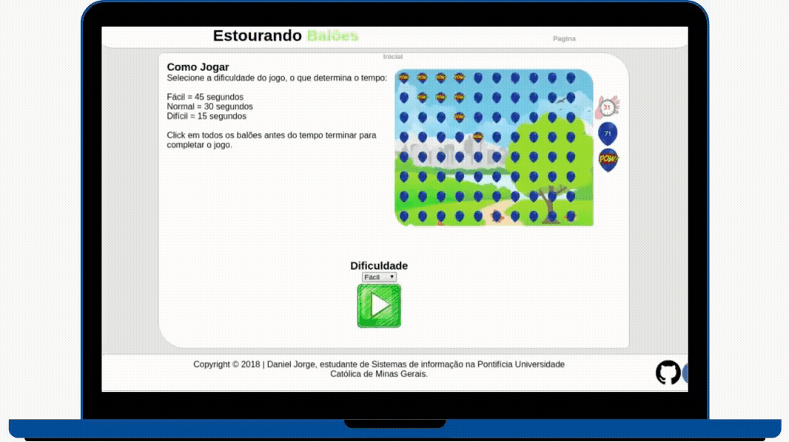

<h1 align="center">
   
</h1>
 
<h1> Popping Balloons </h1>

<p align="left">
   <a href="https://github.com/danieljpgo">
      
   </a>
   
   <!-- <a href="https://github.com/danieljpgo/popping-balloons/stargazers">
      
   </a>
   <a href="https://github.com/danieljpgo/popping-balloons/network/members">
      
   </a> -->
   <a href="https://github.com/danieljpgo/popping-balloons/graphs/contributors">
      
   </a>
  
</p>

> Just a game where being pops balloons. :balloon:

----

<p align="center">
   <a href="#memo-project">Project</a>&nbsp;&nbsp;&nbsp;|&nbsp;&nbsp;&nbsp;
   <a href="#rocket-features">Features</a>&nbsp;&nbsp;&nbsp;|&nbsp;&nbsp;&nbsp;
   <a href="#man_technologist-technologies">Technologies</a>&nbsp;&nbsp;&nbsp;|&nbsp;&nbsp;&nbsp;
   <a href="#runner-getting-started">Getting Started</a>&nbsp;&nbsp;&nbsp;|&nbsp;&nbsp;&nbsp;
   <a href="#page_with_curl-license">License</a>
</p>

<h1 align="center">
   
</h1>

## :memo: Project
The purpose of the project was to just develop a game with the basic knowledge of javascript that I had at the time. 

## :rocket: Features
The main features of the project are:
- **Pop balloons**, ~~of course~~.
- **Difficulty** selection, ~~just reducing the timer~~.
- **Sound effect**.

## :man_technologist: Technologies
The main technologies used to develop the project were:
- Javascript, ~~of course~~.

## :runner: Getting Started
Clone the project with:
```
git clone https://github.com/danieljpgo/popping-balloons.git
```
Double click on:
```
index.html
```

## :page_with_curl: License
This project is under the [MIT license](https://github.com/danieljpgo/popping-balloons/blob/master/LICENSE).
<div>Released in 2018.</div>
<div>README update in 2020.</div>

Developed by [Daniel Jorge](https://github.com/danieljpgo)